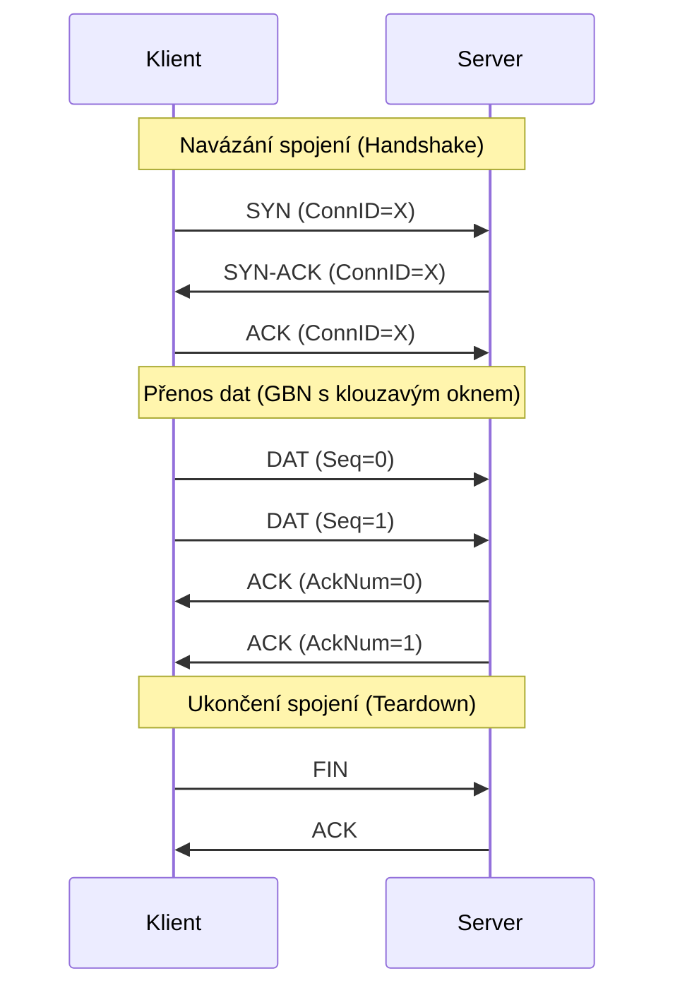

# IPK Projekt 2 - Přenos souborů přes UDP (IPK-RDT)

Tento projekt implementuje spolehlivý přenos dat (Reliable Data Transfer) nad nespolehlivým protokolem UDP. Řešení se skládá z klientské a serverové části v jednom spustitelném souboru (`ipk-rdt`). Architektura protokolu je volně inspirována TCP a pro zajištění spolehlivosti využívá mechanismus chybového řízení Go-Back-N (GBN) s klouzavým oknem.

---

## 1. Formát paketu a hlavičky

Aplikace využívá vlastní transportní protokol. Každý odeslaný UDP datagram obsahuje 17bajtovou hlavičku následovanou užitečným zatížením (payload). Data v hlavičce jsou serializována v síťovém pořadí bajtů (Big-Endian).

| Položka (Pole) | Velikost | Datový typ | Popis |
| :--- | :--- | :--- | :--- |
| **Conn ID** | 4 bajty | Unsigned Int | Pseudonáhodný 32bitový identifikátor generovaný klientem. Slouží k unikátní identifikaci spojení. |
| **Seq Num** | 4 bajty | Unsigned Int | Sekvenční číslo paketu. U datových paketů se s každým novým paketem inkrementuje o 1 (protokol je orientovaný na pakety, ne na bajty). |
| **Ack Num** | 4 bajty | Unsigned Int | Číslo potvrzení (Acknowledgement). Označuje nejvyšší sekvenční číslo paketu, který byl úspěšně a popořadě doručen. |
| **Flags** | 1 bajt | Unsigned Char | Bitová maska řídicích příznaků: <br>`0x01` SYN (Navázání spojení)<br>`0x02` ACK (Potvrzení)<br>`0x04` FIN (Ukončení spojení)<br>`0x08` DAT (Datový paket) |
| **Checksum** | 4 bajty | Unsigned Int | CRC-32 kontrolní součet počítaný z hlavičky (s polem Checksum dočasně nastaveným na 0) a užitečného zatížení. Slouží k detekci poškozených dat. |
| **Payload** | 0 - 1183 B | Bajty | Samotná přenášená data. Maximální velikost je 1183 bajtů, aby celá velikost UDP datagramu (včetně 17B hlavičky) nepřekročila stanovený limit 1200 bajtů. |

---

## 2. Navázání a ukončení spojení (včetně UML)

### Navázání spojení (3-Way Handshake)
Před zahájením přenosu dat probíhá třícestný handshake, který zajistí, že obě strany jsou připraveny komunikovat:
1. **SYN:** Klient vygeneruje náhodné 32bitové `Conn ID` a odešle paket s příznakem SYN (`Seq=0`, `Ack=0`).
2. **SYN-ACK:** Server přijme SYN, "uzamkne" si relaci na přijaté `Conn ID` a odpoví paketem s příznaky SYN a ACK.
3. **ACK:** Klient potvrdí přijetí SYN-ACK odesláním ACK paketu. Spojení je navázáno a může začít přenos dat.

### Ukončení spojení
Ukončení je iniciováno klientem po odeslání všech dat a přijetí příslušných potvrzení:
1. **FIN:** Klient odešle paket s příznakem FIN.
2. **ACK:** Server odpoví paketem ACK, vyčistí své stavy a korektně se ukončí (vypíše data do výstupu a zavře soket). Klient po přijetí ACK rovněž ukončí svou činnost.

### UML Sekvenční diagram



---

## 3. Strategie řazení a potvrzování

* **Řazení:** Protokol funguje na bázi paketů (nikoliv na bázi proudů bajtů). První datový paket má sekvenční číslo (`Seq Num`) `0`, druhý `1`, atd.
* **Potvrzování (ACK):** Používá se strategie **kumulativního potvrzování (Cumulative Acknowledgements)**. Číslo potvrzení v poli `Ack Num` ze strany serveru vždy sděluje: *"Úspěšně a popořadě jsem přijal všechny pakety až do tohoto sekvenčního čísla (včetně)"*.

---

## 4. Strategie retransmise a zpracování timeoutu

Řešení implementuje dva druhy časovačů:
1. **Rychlý lokální časovač retransmise (Fast Retransmit):**
   Klient si pamatuje čas odeslání nejstaršího nepotvrzeného paketu. Pokud do **0.4 sekundy** nepřijde kumulativní ACK pro tento paket, klient provede **Go-Back-N** retransmisi (znovu odešle celé aktuálně nepotvrzené okno). Pro navazování a ukončování spojení (SYN/FIN) je tento kratší interval nastaven na **0.3 sekundy**.
2. **Globální timeout (`-w TIMEOUT`):**
   Odpovídá maximální povolené době bez **jakéhokoliv pokroku v protokolu**. Pokrokem se rozumí například platný krok v handshake, posunutí okna díky novému ACK, nebo doručení platných dat. Výchozí hodnota je 1 sekunda (pokud není specifikováno jinak). Pokud tato doba vyprší, klient i server se bezodkladně ukončí s chybovým návratovým kódem (zabrání se tak nekonečnému čekání, zacyklení, nebo mrtvému bodu při výpadku).

---

## 5. Zpracování duplicitních a mimo pořadí doručených paketů

* **Na straně serveru (Receiver):** Server striktně vyžaduje pakety ve správném pořadí (podle `expected_seq`). Pokud přijde paket mimo pořadí (out-of-order) nebo paket duplicitní, server jej okamžitě **zahodí** a odešle zpět klientovi duplicitní kumulativní ACK odpovídající nejvyššímu doposud správně doručenému paketu (`expected_seq - 1`).
* **Na straně klienta (Sender):** Klient přijímá ACK. Pokud je doručené ACK menší než počátek klouzavého okna (`base_seq`), klient jej ignoruje, protože jde o zpožděné (duplicitní) potvrzení.
* **Poškozené pakety:** Pokud nesouhlasí CRC-32 kontrolní součet nebo je datagram zkrácen, je paket tiše ignorován. K retransmisi pak dojde na základě timeoutu klienta.

---

## 6. Strategie identifikace spojení

K prevenci záměny paketů z různých relací je využito **Conn ID** (Connection Identifier).
1. Klient při startu vygeneruje náhodné 32bitové číslo.
2. Server zpočátku čeká na libovolný validní SYN paket. Jakmile jej přijme, uloží si jeho `Conn ID` a uzamkne se na něj (`self.active_conn_id`).
3. Jakýkoliv budoucí paket (včetně zpožděných paketů z předchozích běhů nebo od jiných klientů), jehož `Conn ID` se neshoduje s tímto zámkem, je serverem i klientem ihned zahozen. Zabraňuje to narušení probíhající komunikace.

---

## 7. Zvolená velikost segmentu a chování okna

* **Velikost segmentu:** Zadání vyžaduje, aby jeden PDU v UDP nepřesáhlo 1200 bajtů. Protože hlavička má 17 bajtů, `MAX_PAYLOAD_SIZE` je tvrdě omezen na `1183 bajtů`. Tím se zamezuje fragmentaci IP datagramů.
* **Chování okna (Window behavior):** Klient využívá **klouzavé okno o fixní velikosti 100 paketů**. Dokud není okno plné (`next_seq < base_seq + window_size`), klient průběžně čte data ze vstupního proudu (souboru/stdin) a odesílá je serveru. Jakmile dorazí platné kumulativní ACK, okno se posune kupředu, z interního bufferu klienta se vymažou potvrzené pakety a cyklus pokračuje. 

---

## 8. Naměřené chování v testovacím prostředí

Během lokálního vývoje bylo spojení podrobeno testům s nástrojem `tc netem`.
* **Ideální podmínky:** Okno o velikosti 100 paketů dokáže velmi rychle saturovat místní linku, díky čemuž jsou přenosy okamžité (limitované primárně rychlostí I/O čtení ze souboru).
* **Ztrátovost 10% (Packet Loss):** Implementovaný Go-Back-N mechanismus úspěšně detekuje výpadky přes Fast Retransmit (0.4s). Následuje propad propustnosti úměrný faktu, že se při každé ztrátě musí přeposlat celé aktivní okno (což je pro GBN typické). Cílový soubor byl ale vždy sestaven korektně a beze ztrát.
* **Zpoždění a rozházení pořadí (Reordering):** Server striktně zahazuje pakety mimo pořadí. To vyvolá duplicitní ACKy a případně retransmisi na straně klienta. Protokol přežije i masivní rozházení pořadí a data rekonstruuje do identické podoby byte-for-byte.

---

## 9. Známá omezení implementace

1. **Efektivita Go-Back-N na ztrátových linkách:** Přestože GBN plní účel a je spolehlivý, na linkách s velkým zpožděním (vysoké RTT) a velkou ztrátovostí je neefektivní. Na rozdíl od mechanismu Selective Repeat, který by přeposílal jen konkrétní ztracené pakety, zahazuje server u GBN všechny následující pakety (byť došly v pořádku), a klient musí poslat zbytečně celé okno znovu.
2. **Statické časovače (Fixed Timers):** Retransmisní timeout lokálního rychlého časovače (0.4s) je konfigurován staticky. Implementace nemá zabudovaný dynamický výpočet RTT (Round Trip Time), jako to dělá TCP. Může tak docházet k přehnaným retransmisím na extrémně pomalých (zpožděných) spojích, nebo zbytečnému čekání na rychlých lokálních sítích.
4. **Server obsluhuje právě jeden přenos:** Po úspěšném či neúspěšném přenosu jednoho byte-streamu se serverový proces korektně ukončí (dle zadání nevyžaduje obsluhu více klientů paralelně).

---

## 10. Návod k použití (Spuštění)

### Překlad
Program je napsán v jazyce Python 3. K vytvoření spustitelného souboru `ipk-rdt` slouží přiložený `Makefile`:
```bash
make
```
Tento příkaz vytvoří v aktuálním adresáři spustitelný skript `ipk-rdt`.

### Spuštění serveru (přijímač)
Server naslouchá na zadaném portu a ukládá přijatá data do souboru nebo na standardní výstup.
```bash
./ipk-rdt -s -p <port> [-a <adresa>] [-o <soubor>] [-w <timeout>]
```
* `-s`: Spustí program v režimu server.
* `-p <port>`: Číslo portu, na kterém bude server naslouchat.
* `-a <adresa>`: (Volitelné) IP adresa, na kterou se má server nabindovat (např. `127.0.0.1` nebo `::1`).
* `-o <soubor>`: (Volitelné) Cesta k souboru, kam se mají uložit přijatá data. Pokud není zadáno, data se vypíší na standardní výstup (stdout).
* `-w <timeout>`: (Volitelné) Maximální doba čekání na pokrok v protokolu v sekundách (výchozí: 1).

### Spuštění klienta (odesílatel)
Klient naváže spojení se serverem a odešle data ze souboru nebo ze standardního vstupu.
```bash
./ipk-rdt -c -p <port> -a <host> [-i <soubor>] [-w <timeout>]
```
* `-c`: Spustí program v režimu klient.
* `-p <port>`: Číslo portu, na kterém server naslouchat.
* `-a <host>`: IP adresa nebo hostname serveru.
* `-i <soubor>`: (Volitelné) Cesta k souboru, který se má odeslat. Pokud není zadáno, data se čtou ze standardního vstupu (stdin).
* `-w <timeout>`: (Volitelné) Maximální doba čekání na pokrok v protokolu v sekundách (výchozí: 1).

---

## 11. Spuštění testů

Součástí projektu je automatizovaný testovací skript `test_suite.py`, který ověřuje funkčnost protokolu v různých podmínkách (ztrátovost, duplikace, korupce paketů, reorder, IPv6).

Testy lze spustit pomocí příkazu:
```bash
make test
```
Skript postupně provede sadu testovacích případů a na konci vypíše celkové skóre.

## 12. Reference a zdroje

Při implementaci byly využity následující zdroje:
1. **RFC 768 (User Datagram Protocol):** https://datatracker.ietf.org/doc/html/rfc768
2. **Kurose, J. F., & Ross, K. W. (2017). Computer Networking: A Top-Down Approach.** (Kapitoly o Reliable Data Transfer a GBN).
3. **Python `socket` documentation:** https://docs.python.org/3/library/socket.html
4. **Python `argparse` documentation:** https://docs.python.org/3/library/argparse.html
5. **CRC-32 (z knihovny `binascii`):** https://docs.python.org/3/library/binascii.html#binascii.crc32
6. **Mermaid.js documentation (pro diagramy):** https://mermaid.js.org/
7. **IPK Projekt 2 - Zadání (Reliable Data Transfer over UDP).**
